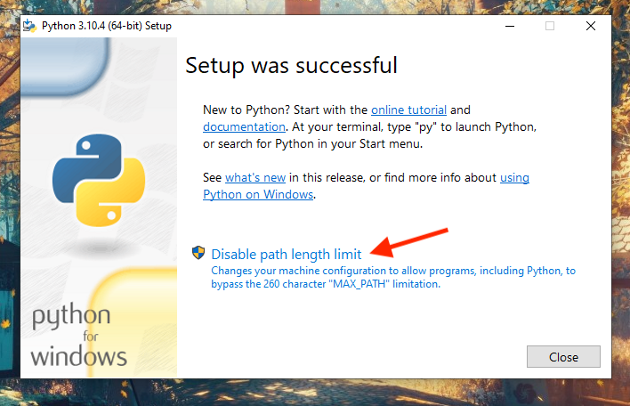
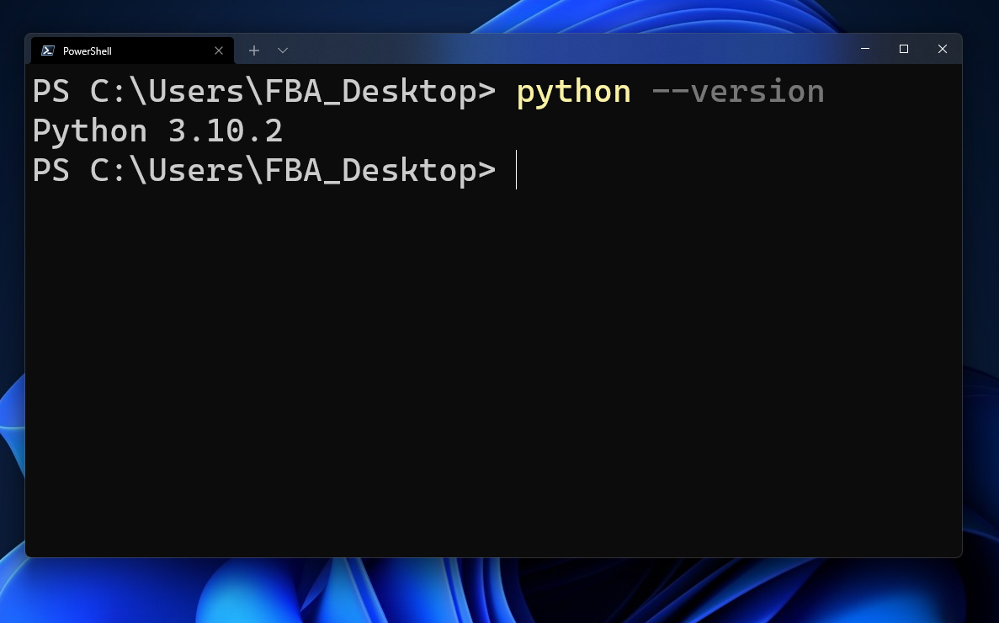
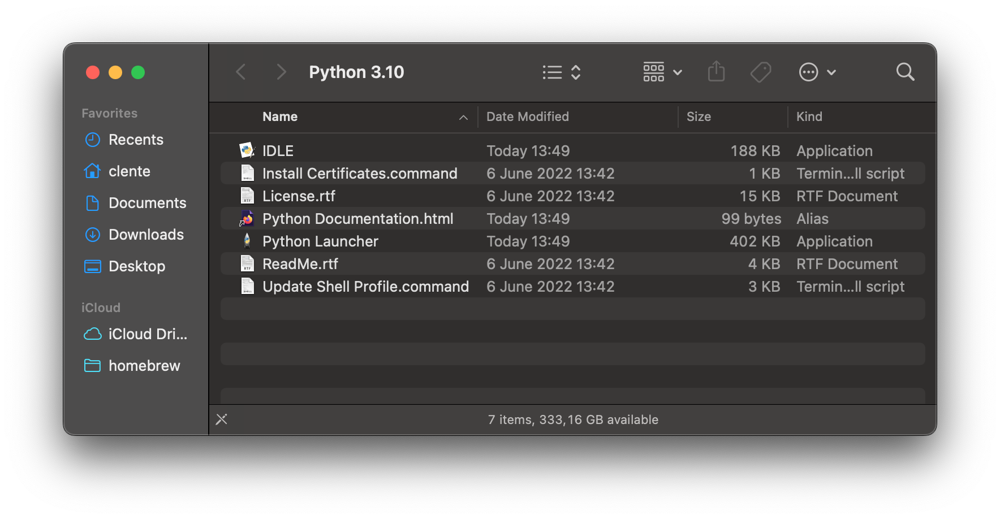
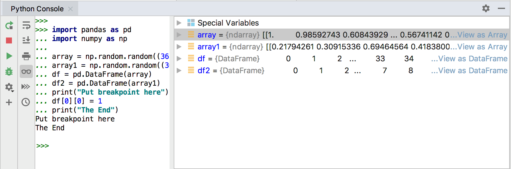

```{r setup, include=FALSE}
options(htmltools.dir.version = FALSE)

link <- function(href, ...) {
  htmltools::a(
    href = href,
    target = "_blank",
    ...
  )
}
```

## Motivação

- Até agora trabalhamos exclusivamente no Google Colab

  - Poucos recursos de hardware
  
  - Baixa customização da interface e do ambiente
  
  - _Minha opinião:_ desincentiva reprodutibilidade e controle de versão
  
- Podemos instalar o Python nas nossas próprias máquinas
  
  - Problemas com a(s) versão(ões) do Python
  
  - Problemas com o controle do ambiente
  
  - Problemas com o espaço necessário
  
  - Não é tão simples quando parece!

---
class: middle, center, inverse
# Instalação

---
## Python no Windows

- Garantir que não há um Python já instalado!

- Baixar executável do instalador: [https://www.python.org/downloads/]()

- Clicar duas vezes no arquivo

```{r, echo = FALSE, fig.align='center'}
knitr::include_graphics("static/win_install_now.png", dpi = 125)
```

---
## Python no Windows

```{r, echo = FALSE}

```

---
## Python no Windows

```{r, echo = FALSE}

```

---
## Python no Linux (Ubuntu)

- Verificar a versão já instalada

- Cada um dos comandos pode retornar uma versão diferente!

```sh
python --version
python2 --version
python3 --version
```

- Atualizar outros pacotes (pode demorar)

```sh
sudo apt-get update
sudo apt-get upgrade -y
```

- Caso seja necessário, instalar o Python 3 à força

```sh
sudo apt-get install -y python3 python3-pip
```

---
## Python no Linux (Ubuntu)

- Configurar as alternativas para o comando `python`

- Obs.: as linhas eram grande demais, por isso eu quebrei elas!

```sh
sudo update-alternatives --install
  /usr/bin/python python /usr/bin/python3.8 1

sudo update-alternatives --install
  /usr/bin/python python /usr/bin/python3.10 2
```

- Escolher a versão mais atual

```sh
sudo update-alternatives --set python /usr/bin/python3.10
```

- Verificar o resultado

```sh
python --version
```

---
## Python no Mac

- Baixar executável do instalador: [https://www.python.org/downloads/]()

- Clicar duas vezes no arquivo

```{r, echo = FALSE, fig.align='center'}
knitr::include_graphics("static/mac_install.png", dpi = 230)
```

---
## Python no Mac

- Examinar a pasta resultante

```{r, echo = FALSE}

```

---
## Python no Mac

- Selecionar a versão mais recente como sendo a padrão

```sh
unlink /usr/local/bin/python
ln -s /usr/local/bin/python3.10 /usr/local/bin/python
```

- Verificar o resultado

```sh
python --version
```

---
## Pip

- Pip é o instalador de pacotes do Python, muito importante

- Vale a pena confirmar se o `pip` também foi instalado

```sh
pip --version
```

- Se for necessário instalar ou atualizar:

```sh
python -m ensurepip --upgrade
```

---
class: middle, center, inverse
# Ambientes Virtuais

---
## Conda

- Conda é um gerenciador de pacotes, dependências e ambientes para Python (e
outras linguagens como R)

  - Anaconda é uma distribuição otimizada de Python que inclui diversos pacotes
  úteis para ciência de dados
  
  - Miniconda é uma versão é um instalador mínimo do Anaconda que não vem com
  todos os pacotes

- Instalar o Miniconda: [https://docs.conda.io/en/latest/miniconda.html]()

  - No Windows, escolher o executável de 64-bits
  
  - No Mac, escolher o pkg Intel ou o pkg M1 a depender do chip
  
  - No Linux, escolher o script de 64-bits e executar o comando:
  
  
```sh
chmod +x Miniconda3-latest-Linux-x86_64.sh
./Miniconda3-latest-Linux-x86_64.sh
```

---
## Conda

- Verificar se a instalação funcionou

```sh
conda --version
```

- Note que o Conda é baseado em uma distribuição própria

  - Os pacotes instalados via Conda não vêm do PyPI, esqueça o Pip
  
  - O Python do Conda também não vem do repositório oficial
  
```sh
# Criar env com uma versão do Python
conda create -n meuenv python=3.8

# Instalar um pacote do novo env
conda activate meuenv
conda install numpy

# Desativar env
conda deactivate
```

---
## Virtualenv

- Virtualenv é uma ferramenta para isolamento de ambientes

  - Parte do Virtualenv já vem embutido via o pacote `venv`

- A instalação é mais simples com o PipX

```sh
# Windows e Linux
python -m pip install --user pipx

# Mac (requer o Homebrew: https://brew.sh/)
brew install pipx
pipx ensurepath
```

- Depois é só usar o PipX para instalar o Virtualenv

```sh
pipx install virtualenv
virtualenv --help
```

---
## Virtualenv

- Diferentemente do Conda, o Virtualenv cria pastas com envs

```sh
virtualenv meuenv
```

- Para ativar um env, é necessário carregar os conteúdos da pasta

```sh
# Windows
Set-ExecutionPolicy Unrestricted -Scope Process
meuenv\Scripts\activate.ps1

# Linux e Mac
source meuenv/bin/activate
```

- Por padrão, a versão do Python é a global, mas podemos mudar

  - É necessário ter essa versão instalada!

```sh
virtualenv --python=/usr/local/bin/python3.8 meuenv
```

---
class: middle, center, inverse
# Ambientes de Desenvolvimento

---
## PyCharm

- IDE clássica, criada em 1991 especificamente para o Python

```{r, echo = FALSE}
knitr::include_graphics("static/pycharm_view.jpg")
```

---
## PyCharm

- Cheia de funcionalidades e ferramentas embutidas

```{r, echo = FALSE}

```

---
## VS Code

- Atualmente o editor de código mais usado do mundo

```{r, echo = FALSE, fig.align='center'}
knitr::include_graphics("static/vscode_view.png", dpi = 350)
```

---
## VS Code

- Simples, rápido e flexível (suporte para qualquer linguagem)

```{r, echo = FALSE, fig.align='center'}
knitr::include_graphics("static/vscode_console.png", dpi = 360)
```

---
## RStudio

- Agora é possível programar Python no RStudio!

```{r, echo = FALSE}
knitr::include_graphics("static/rstudio_view.png")
```

---
## RStudio

- Vamos falar mais sobre a integração entre o R e o Python no futuro

  - Com o pacote `reticulate` é possível rodar Python e R juntos
  
  - Funciona com Virtualenv ou Conda
  
  - O próprio R gerencia os ambientes e as instalações

- No RStudio a integração fica ainda melhor

  - É possível criar um RMarkdown com R e Python misturados
  
  - As duas linguagens conseguem compartilhar objetos!
  
  - Todas as funcionalidades familiares do RStudio com Python
